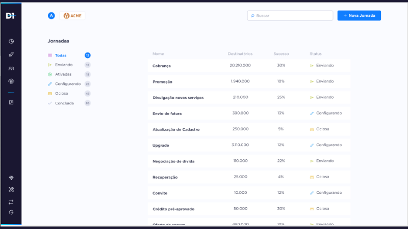

<h1 align="center">
  # D1 Test React ✨

<p align="center">
  <a href="#-tecnologias">Tecnologias utilizadas</a>&nbsp;&nbsp;&nbsp;|&nbsp;&nbsp;&nbsp;
  <a href="#-projeto">Projeto</a>&nbsp;&nbsp;&nbsp;|&nbsp;&nbsp;&nbsp;
  <a href="#-layout">Layout</a>
</p>

<br>

## 🚀 Tecnologias

Esse projeto foi desenvolvido com as seguintes tecnologias:

- [ReactJS](https://pt-br.reactjs.org/)
- [TypeScript](https://www.typescriptlang.org/)
- [Prettier](https://prettier.io/)
- [ESLint](https://eslint.org/)
- [EditorConfig](https://editorconfig.org/)
- [Styled-Components](https://styled-components.com/)

## 💻 Projeto

O projeto consiste em uma tela com a visualização de alguns itens com a utilização de filtros com base no consumo de uma API. Este projeto foi criado utilizando boas práticas e as melhores tecnologias de estruturação de código.

## 🔖 Layout

O layout do projeto pode ser visualizado abaixo:


## ⌨ Como executar o projeto

```bash
# Clonar o repositório
git clone https://github.com/joaolucas2012/d1-react-test.git

# Entrar no diretório
cd d1-react-test

# Baixar as dependências
yarn

# Executar o servidor
yarn start
```

Feito isso, abra o seu navegador e acesse `http://localhost:3000/`.

---

Feito com ♥ por João Lucas!
